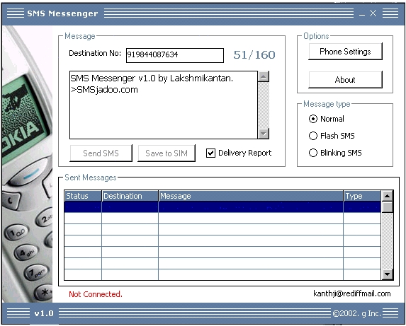



## NOKIA SMS Messenger v1\.0

### Description

Send an SMS message from your Desktop using NOKIA Handset connected via DAU-9P(FBUS) cable. This module lets you to send Flash SMS, Blinking SMS & Normal SMS. For Blinking SMS in the text area add '|'(Shift \) before and after the word you want to blink. Flash SMS is displayed on the receivers mobile without allowing him to select 'Read the message'. Your Feed Back will be appreciated. Please do not forget to Vote for me. thanx.
 
### More Info
 

             |
---                |---
**Submitted On**   |2002-10-21 18:00:38
**By**             |[Lakshmikanth](https://github.com/Planet-Source-Code/PSCIndex/blob/master/ByAuthor/lakshmikanth.md)
**Level**          |Intermediate
**User Rating**    |4.5 (103 globes from 23 users)
**Compatibility**  |VB 6\.0
**Category**       |[Miscellaneous](https://github.com/Planet-Source-Code/PSCIndex/blob/master/ByCategory/miscellaneous__1-1.md)
**World**          |[Visual Basic](https://github.com/Planet-Source-Code/PSCIndex/blob/master/ByWorld/visual-basic.md)
**Archive File**   |[SMS\_Messen14847810212002\.zip](https://github.com/Planet-Source-Code/lakshmikanth-nokia-sms-messenger-v1-0__1-40020/archive/master.zip)

